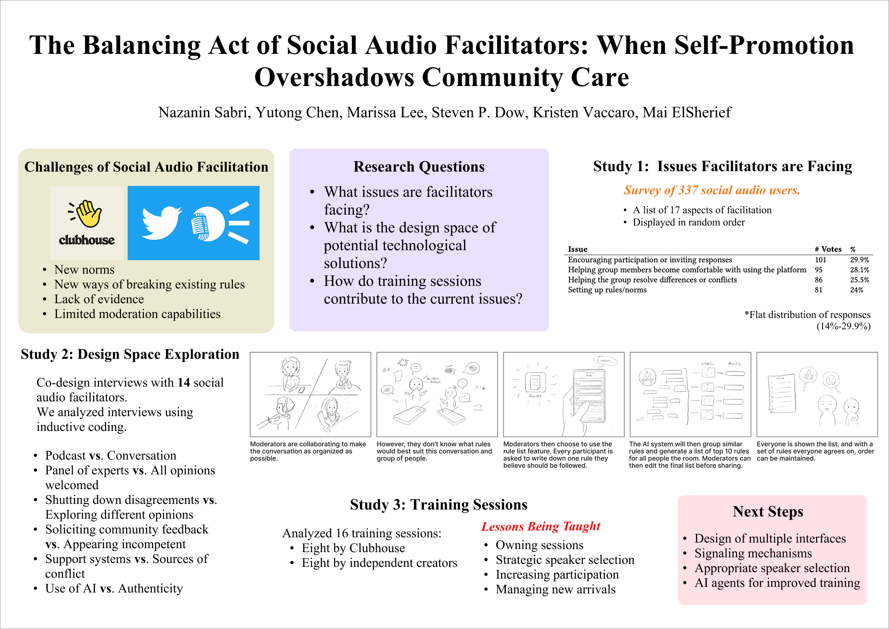
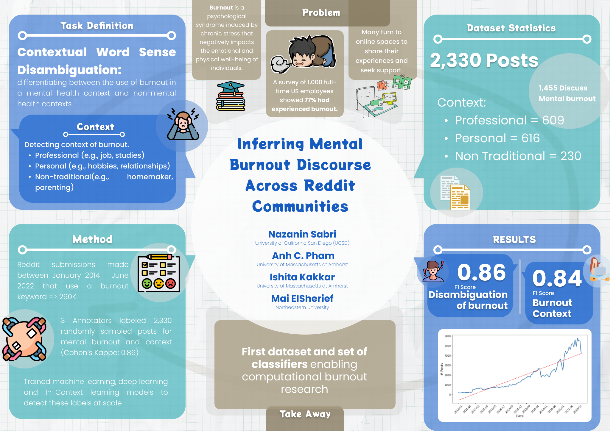

## About

I'm Nazanin, Computer Science Ph.D. student at the University of California, San Diego (UCSD). I'm advised by [Dr. Mai ElSherief](https://melsherief.eng.ucsd.edu/home) and [Dr. Kristen Vaccaro](https://kvaccaro.com/). 

**Research Interests**: Societal Computing, Computational Social Science (CSS), Natural Language Processing (NLP) for Social Good, Applied Machine Learning, Human-Computer Interaction (HCI),
Online Safety & Content Moderation

<!-- I'm currently working on the use of causal inference in reasoning about and dealing with biases in the machine learning pipeline.  -->

Feel free to [email](mailto:nsabri@ucsd.edu) me or check out my [CV](Files/CV.pdf) or [Google Scholar](https://scholar.google.com/citations?user=8wIr3uEAAAAJ&hl=en) profile. 

### Publications

* **Nazanin Sabri**, Yutong Chen, Marissa Lee, Steven P. Dow, Kristen Vaccaro, and Mai Elsherief. 2025. "The Balancing Act of Social Audio Facilitators: WhenSelf-Promotion Overshadows Community Care". To appear in CSCW 2025.
* **Nazanin Sabri**, Bella Chen, Annabelle Teoh, Steven P. Dow, Kristen Vaccaro, and Mai Elsherief. 2023. ["Challenges of Moderating Social Virtual Reality"]((https://dl.acm.org/doi/full/10.1145/3544548.3581329)). In Proceedings of the 2023 CHI Conference on Human Factors in Computing Systems (CHI '23). Association for Computing Machinery, New York, NY, USA, Article 384, 1–20. https://doi.org/10.1145/3544548.3581329
* Ashwin Rao, **Nazanin Sabri**, Siyi Guo, Louiqa Raschid, and Kristina Lerman. "Public Health Messaging on Twitter During the COVID-19 Pandemic: Observational Study." Journal of Medical Internet Research 27 (2025): e63910.
* **Nazanin Sabri**, Anh Pham, Ishita Kakkar, and Mai ElSherief. "Inferring Mental Burnout Discourse Across Reddit Communities." In Proceedings of the Third Workshop on NLP for Positive Impact, pp. 224-231. 2024.
* **Nazanin Sabri**, Sadaf Sadeghian, and Behnam Bahrak. [“A cross-country study on cultural similarities based on book preferences.”](https://www.springerprofessional.de/en/a-cross-country-study-on-cultural-similarities-based-on-book-pre/18481234) Social Network Analysis and Mining, 10, 86 (2020).
* **Nazanin Sabri**, Ridhi Kashyap, and Ingmar Weber. [“Examining Global Mobile Diffusion and Mobile Gender Gaps through Facebook’s Advertising Data.”](https://dl.acm.org/doi/10.1145/3465336.3475120) In Proceedings of the 32nd ACM Conference on Hypertext and Social Media, pp. 287-290. 2021.
* **Nazanin Sabri**, and Ingmar Weber. [“A Global Book Reading Dataset.”](https://www.mdpi.com/2306-5729/6/8/83) Data 6, no. 8 (2021): 83.
* **Nazanin Sabri**, Ali Edalat, and Behnam Bahrak. [“Sentiment Analysis of Persian- English Code-mixed Texts.”](https://ieeexplore.ieee.org/document/9420605) 2021 26th International Computer Conference, Computer Society of Iran (CSICC). IEEE, 2021.
* Alireza Salemi, **Nazanin Sabri**, Emad Kebriaei, Behnam Bahrak, Azadeh Shakery. [“UTNLP at SemEval-2021 Task 5: A Comparative Analysis of Toxic Span Detection using Attention-based, Named Entity Recognition, and Ensemble Models.”](https://aclanthology.org/2021.semeval-1.136/) In Proceedings of the 15th International Workshop on Semantic Evaluation, 2021.
* Tolulope Ogunremi, **Nazanin Sabri**, Valerio Basile, Tommaso Caselli. [“Leveraging Bias in Pre-trained Word Embeddings for Unsupervised Microaggression Detection.”](http://ceur-ws.org/Vol-3033/paper36.pdf) to appear in CLiC-it 2021 Italian Conference on Computational Linguistics, 2021.
* **Nazanin Sabri**, Reyhane Akhavan, and Behnam Bahrak. ["EmoPars: A Collection of 30K Emotion-Annotated Persian Social Media Texts."](https://aclanthology.org/2021.ranlp-srw.23/) Proceedings of the Student Research Workshop Associated with RANLP 2021. 2021.
* Emad Kebriaei, Samaneh Karimi, **Nazanin Sabri**, and Azadeh Shakery. [“Emad at SemEval-2019 Task 6: Offensive language identification using traditional machine learning and deep learning approaches.”](https://aclanthology.org/S19-2107/) In Proceedings of the 13th International Workshop on Semantic Evaluation, pp. 600-603. 2019.
* Hadi Safari, **Nazanin Sabri**, Faraz Shahsavan, and Behnam Bahrak. [“An Analysis of GitLab’s Users and Projects Networks.”](https://ieeexplore.ieee.org/document/9345844) In 2020 10th International Symposium on Telecommunications (IST), pp. 194-200. IEEE, 2020.
* Hadi Safari, **Nazanin Sabri**, Faraz Shahsavan, and Behnam Bahrak. [“Structural Analysis of GitLab’s Users and Projects Networks.”](https://d1wqtxts1xzle7.cloudfront.net/68225361/6-with-cover-page-v2.pdf?Expires=1643758597&Signature=RCgE-ENV0xhrJfPRCVd18ElZomExyu6-uYxAzwU1i1M5eZDR~9Yvc6J~jAdMjnxVddu8vxWb1XLVobI9lI8Kw~foBpkpZcP0bFONzs0ojTz6vV9e0FZPR~EIh6l0ZW4JzDihVer9kltJHh~UPE3EdjqftzCVnAC~nsFOnSnZJfoFKI93d3MoTvvQbRbBfBKmcQBZZPzFWy~YEcluEm2o8~A92VsVgYQ1HLoEQIrkMae2~RpI844ye0VZj3BvNORCH5w9CKWsSYotp2FpOKUo6ifCZdbA3E~oj4W8YwMhJhTIwcPpQVWNHggL~GxTc2D5JKHtoGucfrtqZVETEbs85Q__&Key-Pair-Id=APKAJLOHF5GGSLRBV4ZA) International Journal of Information and Communication Technology Research 12, no. 2 (2020): 54-62.

### Pre-prints

* **Nazanin Sabri**, and Mai Elsherief. "Posting Patterns of Members of Parental Subreddits." arXiv preprint arXiv:2501.16193 (2025).
* Yasaman Jafari, **Nazanin Sabri**, and Behnam Bahrak. ["Investigating the effects of Goodreads challenges on individuals reading habits.”](https://arxiv.org/abs/2012.03932) arXiv preprint arXiv:2012.03932
(2020).
 
### Poster Summaries of Some of My Work

* **Nazanin Sabri**, Yutong Chen, Marissa Lee, Steven P. Dow, Kristen Vaccaro, and Mai Elsherief. 2025. "The Balancing Act of Social Audio Facilitators: WhenSelf-Promotion Overshadows Community Care". To appear in CSCW 2025.

  
* **Nazanin Sabri**, Anh Pham, Ishita Kakkar, and Mai ElSherief. "Inferring Mental Burnout Discourse Across Reddit Communities." In Proceedings of the Third Workshop on NLP for Positive Impact, pp. 224-231. 2024.

